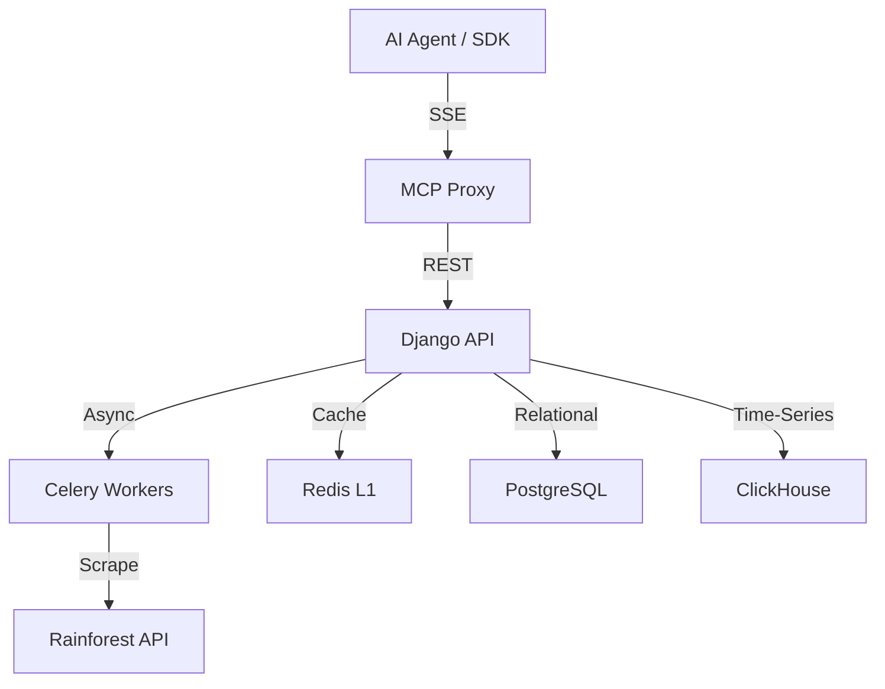

# Amazon Intelligence — Context Protocol MCP Server

Tier-S curated Amazon intelligence for the [Context Protocol](https://ctxprotocol.com) marketplace. This project replaces core product research workflows with on-demand BSR trends, estimated monthly revenue, and NLP review sentiment analysis.

## Project Overview

Amazon-Intel is a dual-layered system:
1.  **Intelligence Layer (MCP)**: Exposes high-level tools to agents and SDK consumers, synthesising raw data into actionable insights.
2.  **Analytics Backend (Django)**: A robust REST API that handles data ingestion, ML-based revenue estimation, and time-series storage in ClickHouse.

### Core Features

-   **BSR Momentum Tracking**: Detect rising products before they hit the best-seller lists.
-   **Revenue Estimation**: ML models trained on BSR, price, and category data.
-   **Sentiment Analysis**: NLP-derived themes from thousands of customer reviews.
-   **Market Opportunity Scoring**: Identifies underserved niches based on profitability and competition.
-   **Full Catalog Discovery**: Enumerate categories and browse ASINs with zero dead-ends.

## Architecture



## Setup & Deployment

### Prerequisites
- Docker & Docker Compose
- Rainforest API Key (for live data)

### Quick Start
1.  Clone the repository.
2.  Create a `.env` file from `.env.example`.
3.  Start the infrastructure:
    ```bash
    docker compose up -d
    ```
4.  Seed the database with demo data:
    ```bash
    docker compose exec web python seed_data.py
    ```

### Running MCP Locally
If you want to run the MCP server without Docker for development:
```bash
pip install -r requirements.txt
python mcp_proxy.py
```

## Available Tools (MCP Surface)

| Method | Surface | Execute Price | Description |
| :--- | :--- | :--- | :--- |
| `amazon_product_intelligence` | both | `$0.001` | Full report (Revenue + BSR + Sentiment) |
| `find_market_opportunities` | both | `$0.001` | Ranks niches by opportunity score |
| `amazon_trending_products` | both | `$0.001` | Rising BSR momentum detection |
| `get_bsr_history` | execute | `$0.0005` | Daily BSR time-series |
| `get_all_categories` | both | `$0.0002` | Catalog enumeration |
| `browse_by_category` | both | `$0.0002` | Category-specific ASIN listing |

## Documentation
-   [MCP Implementation Details](README.mcp.md)
-   [ClickHouse Schema](clickhouse_schema.sql)
-   [API Reference](docs/mcp-builder-template.md)

---
*Context Protocol marketplace — Amazon Intelligence contributor.*
